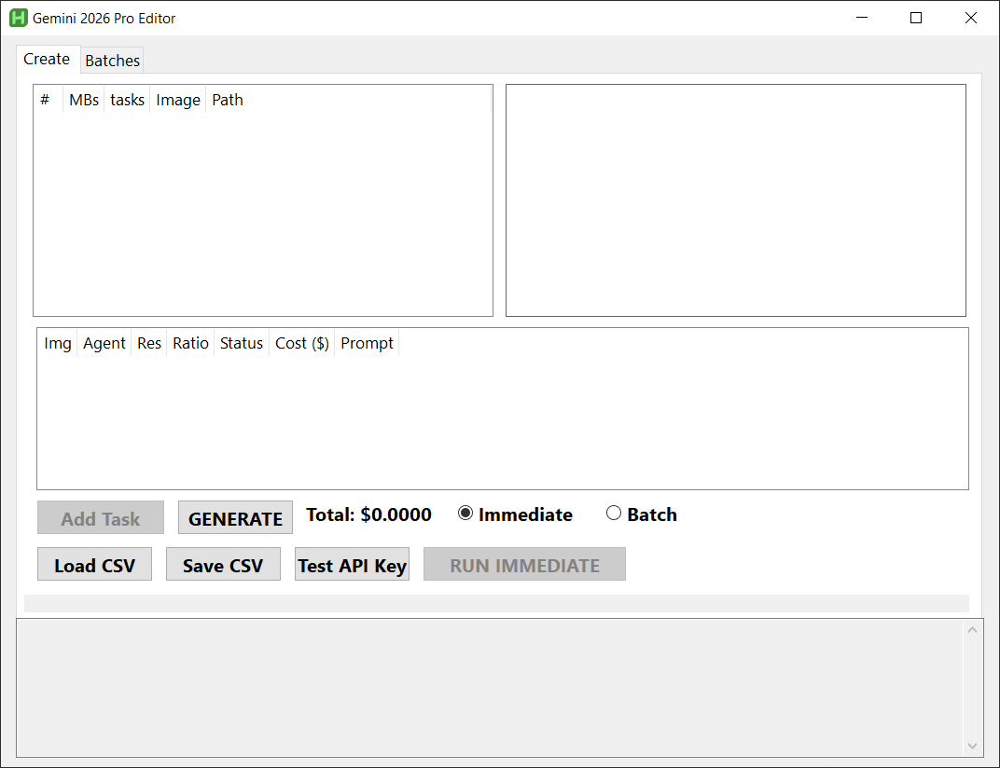
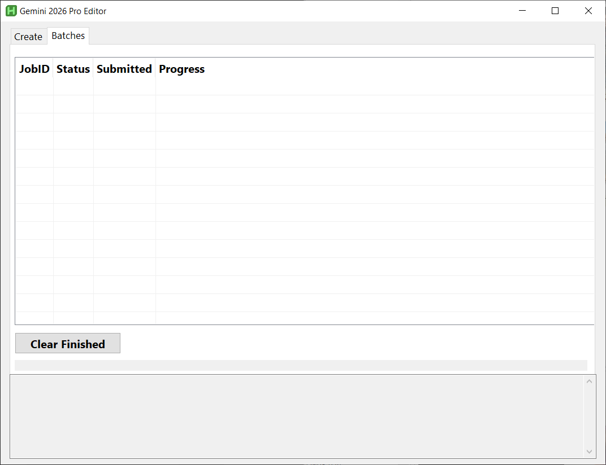

You probably want the latest version of this script. 
You also need AHK AutoHotKey v2. https://www.autohotkey.com/download/ 
 
NOTE: I have all the safety settings disabled, use any of the other ones to re-enable.
<code>
        . '"safetySettings": ['
            . '{"category": "HARM_CATEGORY_HARASSMENT", "threshold": "BLOCK_NONE"}, '
            . '{"category": "HARM_CATEGORY_HATE_SPEECH", "threshold": "BLOCK_NONE"}, '
            . '{"category": "HARM_CATEGORY_SEXUALLY_EXPLICIT", "threshold": "BLOCK_NONE"}, '
            . '{"category": "HARM_CATEGORY_DANGEROUS_CONTENT", "threshold": "BLOCK_NONE"}'
</code> 
Settings are; BLOCK_NONE, BLOCK_ONLY_HIGH, BLOCK_MEDIUM_AND_ABOVE, BLOCK_LOW_AND_ABOVE, HARM_BLOCK_THRESHOLD_UNSPECIFIED 
 
This AI image Editor/Generator was a collaboration between me and google gemini/jules. 
It all started when I was asking about the nano banana and nano banana pro API and it offered to write a bat file.
So I asked, "how about an AHK instead?", and here we are weeks later...
it works, it's ugly and probably buggy, it freezes when doing http.. but it's free. ;) 
 
Before you complain about something, visit https://paypal.me/ctg3d  
I can totally be encouraged to fix/upgrade things faster... 
 
<b>Getting started:</b> 
 Get your API key from google, see AHK source for URL, drop your key in the code and run the app. 
 "log in to https://aistudio.google.com/ create new project, then create an API key." 

<b>Usage:</b> 
 Drag and drop images to edit OR click Generate to make an image from scratch. 
 Pick an image in the list or choose the GENERATE row. 
 Click the "add task" button 
 Fill out the popup info. The ratio defaults to the closest of the image. ** 
 Click Run Immediate/Batch button, wait for the magic. 
 Check your img folder where you ran the script for new images. 
 Then repeat 
 
<b>Actions:</b> 
 Use shift or ctrl to pick several images, then press "add task". 
 double click to browse/change the image on the image list. 
 double click to edit the task popup on the task list. 
 Delete key deletes the selected image/task. 
 CTRL+r = reload, great for clearing the list. 

<b>** prompt help **</b> 
 If you have multiple images, say a hat and a person, you can say stuff like "put the hat on the person". 
 If you ae making an image from scratch, make sure to let the AI know what you want to see; 
  backgrounds, foreground, subjects, camera shot (full body, portrait, etc) and so on. 
  if you leave anything out, the AI will make something up. 
 
Keep in mind, the AI will still likey make things up any way, it's a bit of a free spirit. 

